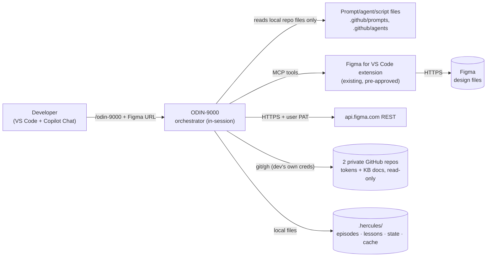

# ODIN Flow — Security Overview (TET Submission)

> **Audience:** Infosec / Technical Evaluation Process (TET) reviewers.
> **Purpose:** answer the "what does this touch, what does it store, what can it execute"
> questions for a new AI agent tool before rollout approval.
> For how the system works day-to-day, see [INTERNALS.md](INTERNALS.md) and
> [../use/USAGE.md](../use/USAGE.md) — this doc only covers risk-relevant facts.

**Status:** DRAFT — pending Infosec review. See [§12](#12-open-items-for-reviewers) for
items that need an owner/contact before submission.

---

## Table of contents

1. [Summary](#1-summary)
2. [Scope of this review](#2-scope-of-this-review)
3. [Architecture & data flow](#3-architecture--data-flow)
4. [Third-party dependencies](#4-third-party-dependencies)
5. [Data handled & classification](#5-data-handled--classification)
6. [Secrets & authentication](#6-secrets--authentication)
7. [Execution surface](#7-execution-surface)
8. [Network egress](#8-network-egress)
9. [Logging & audit trail](#9-logging--audit-trail)
10. [Risks & mitigations](#10-risks--mitigations)
11. [Rollback / kill-switch](#11-rollback--kill-switch)
12. [Open items for reviewers](#12-open-items-for-reviewers)

---

## 1. Summary

**ODIN Flow** is a suite of GitHub Copilot custom agent skills (Markdown prompt files + Figma
Plugin API scripts, no new service) that automates part of the Figma → design-system →
Storybook component pipeline for the design-system team. It runs entirely inside a developer's
existing VS Code + GitHub Copilot Chat session on their own machine.

- **No new server, no new infrastructure, no publicly exposed endpoint.**
- **No new AI provider** — inference runs on the organisation's existing GitHub Copilot
  subscription (Anthropic Claude models via Copilot), same as any other Copilot Chat usage.
- **No new persistent credential type** — it reuses the developer's existing Figma login/PAT
  and existing `git`/`gh` credentials; it does not introduce a service account or API key of
  its own.

## 2. Scope of this review

This document assesses **the agent skill suite in this repository only**: the prompt files
(`.github/prompts/`), agent definitions (`.github/agents/`), the local memory harness
(`.github/prompts/.hercules/`), and the Figma Plugin API / Node / Python scripts they invoke.

**Out of scope** (pre-existing, separately governed platforms this suite merely *consumes*):
- GitHub Copilot Chat itself (model runtime, org auth, data-handling policy).
- The **Figma for VS Code** marketplace extension (the MCP bridge) and Figma's own product/API.
- GitHub.com repo hosting and the developer's personal `gh`/SSH credentials.

## 3. Architecture & data flow

- Everything above the Figma/GitHub boxes runs **locally, in the developer's own session** —
  there is no shared backend component belonging to this suite.
- The orchestrator and every worker (MODI, VALI, MIMR, SAGA, Librarian) are prompt files loaded
  into the same Copilot Chat conversation; "dispatch" means starting an isolated sub-conversation
  on the same Copilot infrastructure, not a network call to a different system.

## 4. Third-party dependencies

| Dependency | Role | Governance |
| --- | --- | --- |
| GitHub Copilot Chat | Runs the agent/model inference | Existing org subscription — out of scope (§2) |
| Figma for VS Code (marketplace extension, publisher: Figma) | MCP bridge for Figma reads/writes | Existing, installed manually by the developer — out of scope (§2) |
| Figma REST API (`api.figma.com`) | Direct token/plugin-data reads by MIMR | Figma's own API, called over HTTPS with a user-scoped PAT |
| `BetssonGroup/core-design-system-variables` (private GitHub repo) | Source of truth for design tokens (Librarian mirrors read-only) | Org-owned repo; access via developer's existing `gh`/SSH credentials |
| `BetssonGroup/betsson-kb-docs` (private GitHub repo) | Design-system knowledge-base docs (Librarian mirrors read-only) | Org-owned repo; access via developer's existing `gh`/SSH credentials |
| `devDependencies` in `package.json` (Stencil, Storybook, Lit, Vite, TypeScript) | Build tooling for the generated Storybook components | Standard npm packages, not part of the agent runtime — same review path as any other frontend dependency bump |

No new SaaS vendor, API key, or subprocessor is introduced by this suite.

## 5. Data handled & classification

| Data | Description | Classification |
| --- | --- | --- |
| Figma node/frame metadata | Layer names, IDs, variant props, screenshots of the frame being worked on | Internal design-system content — no customer data, no PII |
| Design tokens | Token names/values (spacing, color, typography) from the design-system token repo | Internal design-system content |
| Run summaries | One-line human-authored descriptions of what a run did (e.g. "Apply tokens to FDS-Badge") | Internal, non-sensitive |
| Figma PAT | User's own Figma personal access token | **Secret** — see [§6](#6-secrets--authentication) |

**Nothing processed by this suite is customer data, production data, or PII.** The suite only
ever operates on whatever Figma frame the developer explicitly points it at (an internal design
file) and the two named design-system data repos in §4. As with any Copilot Chat usage, whatever
content is in-scope of a request is sent to Copilot's model backend — this is unchanged behavior
from normal developer use of Copilot Chat and is not a new data flow introduced by this suite.

## 6. Secrets & authentication

**The only secret this suite handles is the user's own Figma PAT** (`figd_...`), needed because
MIMR reads Token Studio data via the Figma REST API (`sharedPluginData`), which isn't exposed
through the MCP bridge.

- **Generation:** the developer creates the PAT themselves at figma.com → Settings → Security →
  Personal access tokens. It is scoped/owned by that user, not a shared or service credential.
- **Prompting:** ODIN asks for it once, in chat, only if no saved session exists.
- **Storage:** written to a single local file, `.odin-session`, at the repo root, in the form
  `PAT=<token>` / `LAST_FRAME=<url>`.
  - Written with **file mode `600`** (owner read/write only) — see `sessionWrite()` in
    [`.hercules/hercules.mjs`](../../.github/prompts/.hercules/hercules.mjs).
  - **Automatically added to `.gitignore`** the first time it's written, before the write happens
    — verified by an automated test (`hercules.test.mjs` → *"session write/read/clear
    round-trips and gitignores the file"*), so it cannot be accidentally committed.
- **Reference, never inline:** every other store (`state/<runId>.json`, `episodes.jsonl`,
  `lessons.jsonl`) references the PAT only via the literal string `.odin-session` (`patRef`) —
  the token itself is never copied into any of those files.
- **Never echoed:** the PAT is never printed back to chat, logs, or terminal output by any
  script in this suite.
- **Expiry handling:** a `401`/`403` from the Figma REST API deletes the stale session file and
  re-prompts the user — no retry with a known-bad token.
- **Revocation:** the user can revoke the PAT at any time from figma.com; this immediately
  breaks MIMR's REST calls with no other cleanup required.
- **Shared-machine guidance:** documented in USAGE.md — on a shared host, prefer an environment
  variable / OS keychain over persisting `.odin-session`.

GitHub Copilot's own authentication (org SSO/OAuth) and the developer's `gh`/SSH credentials for
the two private repos are pre-existing and are not modified, stored, or proxied by this suite.

## 7. Execution surface

Two distinct execution contexts are involved — neither grants new host-level capability:

1. **Figma Plugin API scripts** (`*.figma.js` under `mimr/scripts/`, `vali/scripts/`,
   `modi/scripts/`) run **inside Figma's own plugin sandbox**, invoked through the `use_figma`
   MCP tool. They can only call the Figma Plugin API (read/write node properties, variables,
   styles) — there is no filesystem, network, or shell access available from that sandbox.
2. **Local Node/Python scripts** (`hercules.mjs`, `token-lookup.py`,
   `generate-component-css.mjs`, `sync-kb.sh`) run as ordinary local processes under the
   developer's own OS user account — the same trust boundary as running any other script
   already checked into this repo. They:
   - only read/write files under `.github/prompts/` (plus the repo-root `.odin-session` and
     `.gitignore`),
   - only reach the network via `git`/`gh` against the two named repos in §4,
   - do not accept or execute arbitrary shell strings from Figma content or model output — every
     script is a static, version-controlled file.

Agents are explicitly instructed to **never write ad-hoc Plugin API code** — only the pre-written,
reviewed scripts above — and each agent's boot sequence includes a **self-check gate** that
verifies those scripts were actually loaded before the first Plugin API call. This bounds the code
that ever actually executes to what's reviewable in this repo, rather than arbitrary
model-generated code.

## 8. Network egress

| Destination | Protocol | Auth | Purpose |
| --- | --- | --- | --- |
| `api.figma.com` | HTTPS | User's Figma PAT (bearer) | MIMR reads/writes Token Studio `sharedPluginData` |
| Figma MCP bridge (via the Figma VS Code extension) | HTTPS (handled by the extension) | Existing Figma sign-in | `get_design_context`, `get_metadata`, `get_screenshot`, `use_figma` |
| `github.com` | HTTPS/SSH (`git`, `gh`) | Developer's existing `gh`/SSH credentials | Read-only sparse clone/fetch of the 2 named private repos (Librarian mirror refresh) |
| GitHub Copilot backend | HTTPS (handled by Copilot Chat) | Existing org Copilot auth | Model inference — identical to normal Copilot Chat usage |

No other outbound destinations exist in this suite's scripts or prompts. No analytics/telemetry
is added by this suite itself.

## 9. Logging & audit trail

| Store | Committed to git? | Contents | Notes |
| --- | --- | --- | --- |
| `.hercules/episodes.jsonl` | Yes | One line per run phase (`open`/`step`/`close`): `runId`, `skill`, timestamp, a short human-authored summary | By design, summaries never include a node ID or secret — see the naming rule in `odin-9000.prompt.md` |
| `.hercules/lessons.jsonl` | Yes | Durable "lesson learned" entries (what went wrong / the fix) | Same no-secrets constraint |
| `.hercules/state/<runId>.json` | **No** (gitignored) | Working state for an in-progress run: frame URL, plan, observations | Volatile, local-only |
| `.hercules/cache/*` | **No** (gitignored) | Resolved variable-ID maps, synced token/KB mirror | Rebuildable, local-only |
| `.odin-session` | **No** (gitignored, mode 600) | PAT + last frame URL | See §6 |

Nothing in the two **committed** files is expected to contain a secret by construction (they hold
short summaries, not raw payloads or tokens). A recommended belt-and-braces control — not yet
implemented — is a pre-commit/CI grep for `figd_` across the repo; flagged in §12.

## 10. Risks & mitigations

| Risk | Mitigation |
| --- | --- |
| Prompt injection via crafted Figma layer/content names attempting to alter agent behavior | Agents only call whitelisted, version-controlled scripts (§7) — there is no free-form shell/file execution path for injected content to reach. Figma **writes** are confirmed with the user before Phase 3 execution. |
| PAT exposure on a shared/multi-user machine | File is `mode 600` + gitignored; documented guidance to prefer an env var/keychain on shared hosts; revocable instantly at figma.com. |
| Uncontrolled cost/scope from model escalation (dispatching a subagent on a more expensive/capable model) | Escalation safety gate requires an explicit `vscode_askQuestions` approval before any subagent runs above its pinned default model; declines fall back to the default with no blocked step. |
| Secret or sensitive payload leaking into the committed audit trail | Schema keeps `episodes.jsonl`/`lessons.jsonl` to short, human-authored summaries only — no raw Figma payloads or tokens are ever written to them by the CLI. |
| Supply-chain exposure via the KB/token repo sync | Read-only sparse clone of two named, org-owned private repos, over the developer's own existing authenticated `git`/`gh` access — no write access, and the synced content is data (JSON/Markdown), never executed as code. |
| Accidental commit of local state, cache, or the PAT file | Covered by explicit `.gitignore` rules (`.hercules/state/*`, `.hercules/cache/*`, `.odin-session`) verified by an automated test in `hercules.test.mjs`. |

## 11. Rollback / kill-switch

- **Disable Figma access entirely:** uninstall or disable the Figma for VS Code extension.
- **Revoke Figma access immediately:** delete the PAT at figma.com → Settings → Security —
  breaks MIMR's REST calls with no other cleanup needed.
- **Stop using the suite without uninstalling anything:** the skills are inert unless explicitly
  invoked via a slash command in Copilot Chat — there is no background process or scheduled job.
- **Remove the local memory/audit trail:** delete `.github/prompts/.hercules/` (history remains
  in git history for any commits already made, if that's desired for audit purposes).
- **Remove the capability entirely from a clone:** delete `.github/prompts/` and
  `.github/agents/` — the suite is pure config/prompt files with no build step, so nothing else
  needs uninstalling.

## 12. Open items for reviewers

The following need an answer/owner before this is submitted to Infosec — flagging rather than
guessing:

- [ ] **Repo/tool owner** and **on-call/escalation contact** for TET sign-off.
- [ ] Confirm whether Infosec wants a **CI check** added that fails the build if `figd_` (or any
      PAT-shaped string) appears in a committed file, as the belt-and-braces control noted in
      §9/§10.
  - Confirm the **two private repo names** in §4 are still correct/current and whether Infosec
      needs the actual repo access-control list (who has read access) attached separately.
- [ ] Confirm whether Copilot Chat's own data-handling/retention policy documentation needs to be
      attached as an appendix, or whether Infosec already holds that from Copilot's own approval.
